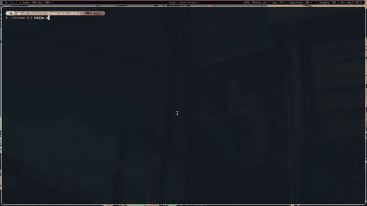

# Chroma Text Editor
Chroma is one of my first projects, it is basically a very simple terminal based text editor with very limited functionaliy written in C.(it has a lot of issue I will try to improve in the future)
# Preview

# Usage
run `./chroma-0.1 help` for options

```
Usage: ./chroma-0.1 file_name

 Command Mode: 

 k --move up
 j --move down
 l --move right
 h --move left
 s --save file
 q --quit the program
 i --edit mode

 Edit Mode: 

 esc --quit edit mode and enter command mode```
